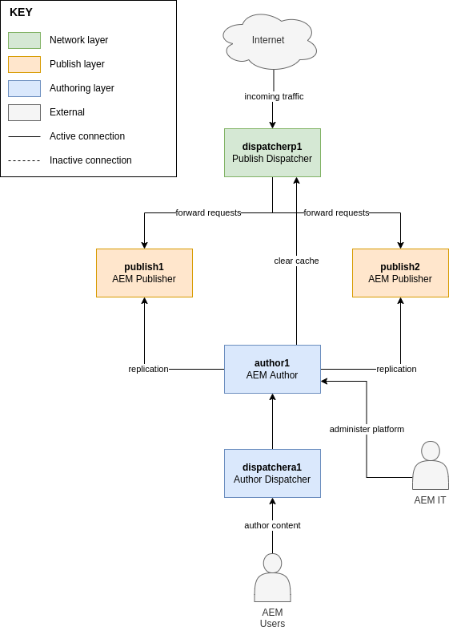
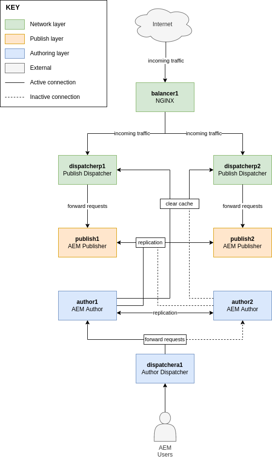

# aem-deployments

This project serves to create a examples for typical AEM deployments.

The project was built primarily using Ansible and Docker, based on the [ansible-playground project](https://github.com/theopendle/ansible-playground).

## Deployments

Each tag in this repo corresponds to one of the deployment architectures listed below. Click on the images to open the tag in question.

### Simple
[]()

This model is the cheapest to deploy and simplest to maintain, using the dispatcher for cacheing, security and load balancing. Disaster recovery on the Author instance would require a daily backup of the TarMK repository for a 24H RPO.

Additional documentation:
* [Dispatcher: Legacy setup](https://experienceleague.adobe.com/docs/experience-manager-learn/dispatcher-tutorial/chapter-2.html%3Flang%3Dit#the-%E2%80%9Clegacy%E2%80%9D-setup)
* [AEM: Single TarMK](https://experienceleague.adobe.com/docs/experience-manager-64/deploying/deploying/recommended-deploys.html?lang=en#single-tarmk-instance)


### Horizontally scaled
[]()

This model increases redundancy by duplicating the publish dispatchers and serving requests using a dedicated load-balancer. A cold-standy Author instance is also introduced for quick disaster recovery.

Additional documentation:
* [Dispatcher: Multi-legged setup](https://experienceleague.adobe.com/docs/experience-manager-learn/dispatcher-tutorial/chapter-2.html%3Flang%3Dit#multi-legged-setup)
* [AEM: Cold Standby TarMK](https://experienceleague.adobe.com/docs/experience-manager-64/deploying/deploying/recommended-deploys.html?lang=en#tarmk-cold-standby)


## Run the deployment

> :warning: **Requires local setup**: This project was developed on a Debian Linux system. It requires ansible version v2.9+ to be installed on the host machine. 

Due to the proprietary nature of the AEM platform, the fully configured instances cannot be a part of this open-source project (ie: there is no Adobe proprierary software in the images of the containers or this repo in general). For that reason, `docker` is used to create essentially empty containers and then `ansible` is used to do all the AEM-specific configuration. 

1. If you havent already, install:
    * [Ansible](https://docs.ansible.com/ansible/latest/installation_guide/intro_installation.html)
    * [Docker](https://docs.docker.com/get-docker/)

2. Download the following Adobe software and place them in the `ansible/files` folder:
    * The cq-quickstart JAR from the [Adobe Software Distribution website](https://experience.adobe.com/#/downloads/content/software-distribution/en/aem.html) (eg: `cq-quickstart-6.5.0.jar`)
    * The latest AEM Service Pack from the [Adobe Software Distribution website](https://experience.adobe.com/#/downloads/content/software-distribution/en/aem.html)(eg: `aem-service-pkg-6.5.12.0.zip`)
    * The dispatcher module TAR from the [Dispatcher download page](https://experienceleague.adobe.com/docs/experience-manager-dispatcher/using/getting-started/release-notes.html?lang=en#downloads) (eg: `dispatcher-apache2.4-linux-x86_64-ssl1.1-4.3.5.tar.gz`)

3. Copy your license.properties file in the `ansible/files` folder

4. Build the container image(s) and run the containers using the following command:
    ```bash
    docker build ansible-base -t ansible-base && docker-compose kill; docker-compose rm -f && docker-compose build && docker-compose up -d
    ```

5. Check the variables declared in the `ansible/vars/default.yaml` file. You can change them there if necessary, or [override them on the command-line](https://docs.ansible.com/ansible/latest/user_guide/playbooks_variables.html#defining-variables-at-runtime) in the next step using `--extra-vars`.

6. Run setup of the environment with the following command:
    ```bash
    ansible-playbook ansible/setup.yaml -v -i ansible/hosts.yaml
    ```
    > :info: **Takes a bit of time**: Since the playbook is responsible for setting up the entire AEM deployment and config, it is normal for it to run for a few minutes, depending on your machine specs.
